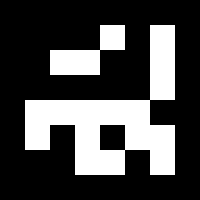
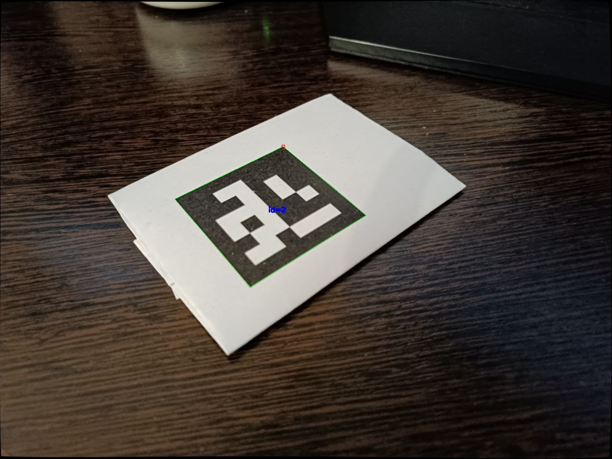
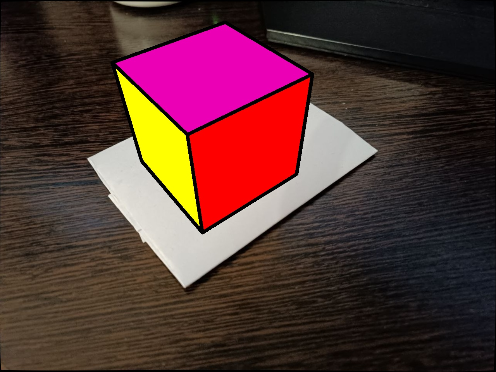

# Вестников Роман - 5 Лабораторная работа

## Калибровка

Сперва была сгенерирована доска ChAruco размерами 7 х 10 для калибровки камеры.

  
      

Было сделано 29 кадров на камеру телефона, к которой в дальнейшем и будет применена калибровка. Данные для калибровки хранятся в каталоге _./python/aruco_data_.
Калибровка производилась при помощи средств OpenCV и Aruco на языке Python. Главной ф-ей для калибровки была _aruco.calibrateCameraAruco_. Весь код прдеставлен в _./python/calibrate.py_. Результат калибровки (матрица камеры и коэффициенты дисторсии) был записан в файл _calibration.yaml_.

___

## Инференс - детекция маркера и рисование куба

Из словаря _aruco.DICT_6X6_250_ был сгенерирован маркер, который затем должен детектиться алгоритмом. 

  
      

Сам алгоритм детекции маркера заключается в загрузке данных калибровки. Затем производится андисторсия изображения для нивелирования искажений - _cv2.undistort_. Далее следует непосредственно поиск маркеров на изображении по указанному словарю, используя ф-ию _aruco.detectMarkers_. На выходе получаем 2d координаты вершин обнаруженных маркеров в плоскости изображения.

  
      

Затем при помощи ф-ии _aruco.estimatePoseSingleMarkers_, этих координат, а также калибровачных параметров, происходит определение 3d ориентации маркера относительно камеры. Результат получается в виде векторов _rvec_ и _tvec_. 

Далее производится непсредственно формирование куба. Для этого нужны координаты всех восьми его вершин, спроецированные на плоскость изображения. С этим очень помогает ф-ия _cv2.projectPoints_. Она принимает на вход некие точки с трёхмерынми координатами и проецирует их на плоскость изображения, используя коэффициенты калибровки и векторы ориентации. В качестве исходных точек мы должны задать координтаы нашего куба, относительно центра его нижней грани. Также необхолдимо учесть масштаб куба, соответсвенно размеру маркера.

  
      

Затем производится рисование граней куба. Для этого нужно правильно оценить взпимное положение граней, а также их перекрытие. Сами грани строятся по вершинам, соответсвующим тем точкам, которые мы указывали для _cv2.projectPoints_. 

Для каждой грани создаётся свой объект класса _CubeFace_. Основными атрибутами этого класса являются координаты вершин грани, центр, цвет, а также должна ли она отображаться. Также у каждой грани есть её положение в 3d пространстве относительно камеры (передняя, задняя, левая, правая, верхняя). Для его определения используется ф-ия _get_positions_, попарно сравнивающая все грани. 

После этого определяется перекрытие левой и правой граней вехней или передней, и в случае отстутсвия перекрытия - грань отображается. Передняя гроань отображается всегда, задняя - никогда. В общем случае за выполнение всех этих операций отвечает ф-ия _draw_cube_.

  
      

Общий код всей детекции написан на языке _Python_ (для отладки), и на _C++_ (для инференса). Первый файл лежит в _./python/detect.py_. Второй в _./main.cpp_.

В качетве генератора видеопотока испольхуется камера телефона, подключённая к компьютеру через Wi-Fi.

Демонстрация выполнения программы на нескольких маркерах представлена в видеофайле _demo.avi_.
